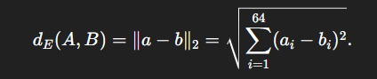
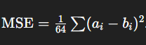
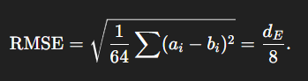

# Distancia Euclidiana

# 1) Idea intuitiva (en palabras)

Dos matrices 8×8 que representan imágenes en escala de grises pueden verse como dos vectores de 64 valores. Si quieres saber “qué tan parecidas” son, calcula la **distancia** entre esos vectores: cuanto menor la distancia, más parecidas.
La **distancia euclidiana** (la distancia geométrica en el espacio 64-dimensional) es una forma directa y fácil de interpretar: distancia = 0 ⇒ idénticas.

---

# 2) Fórmula matemática (precisa)

Sea (A) y (B) dos matrices (8\times8). Si las “aplanamos” en vectores a, b pertenece a los R^64 (por ejemplo fila por fila), la distancia euclidiana es:

Si los valores van de 0 a 16 (tu caso), el **máximo posible** de esta distancia ocurre cuando cada componente difiere en 16. Calculemos eso paso a paso:

* (16^2 = 256).
* Hay 64 elementos: (64 x 256 = 16384).
* raiz cuadrada de 16384 = 128).

Entonces el rango de (d sub E) es ([0,128]). Esto es útil para normalizar.

---

# 3) Normalización y métricas relacionadas

Es útil normalizar la distancia para comparaciones:

* Distancia normalizada: (d_{norm} = d_E / 128) → rango ([0,1]).
  Interpretación propuesta (reglas heurísticas, calibrar con tus datos):

  * (d sub {norm} <=  0.05) → casi idénticas (prácticamente iguales).
  * (0.05 < d sub {norm} <= 0.15) → muy parecidas.
  * (0.15 < d sub {norm} <= 0.30) → parecidas.
  * (d sub {norm} > 0.30) → diferentes.

Estas cifras son **sugerencias**: lo ideal es calibrar (ver más abajo).

Otras métricas útiles:

* **MSE** (Mean Squared Error):

  
* Es la versión promedio del cuadrado del error.
* **RMSE** (root MSE): raiz cuadra de MSE — comparable a `d sub E` pero dividido por raiz cuadrada de 64 = 8).
* **Cosine similarity**: útil si te importa la dirección más que la magnitud (menos sensible a brillo/contraste global).
* **PSNR** (Peak Signal-to-Noise Ratio): estándar en imágenes — más alto significa más parecido.

Relación entre d_E y RMSE:

---

# 4) Qué significa “muy parecidas” para dígitos

Si tus matrices representan dígitos manuscritos, dos matrices pueden ser visualmente muy similares pero representar dígitos distintos (p. ej. un “3” estilizado vs “8” parcialmente borrado). Por eso:

* La distancia euclidiana te dice **similitud numérica** entre pixeles.
* Si quieres **clasificar** el dígito (¿mismo número?), combina la distancia con un clasificador (k-NN, SVM, red neuronal). Ejemplo: k-NN sobre vectores 64D con distancia euclidiana; si el vecino más cercano está por debajo de cierto umbral y su etiqueta coincide, asumimos mismo dígito.
* Recomendación práctica: usa un conjunto de validación (ejemplos conocidos) para elegir el umbral que maximice precisión/recall.

---

# 5) Cómo elegir umbrales de decisión (pasos prácticos)

1. Reúne un conjunto etiquetado (pares de matrices): pares “mismo dígito” y “diferente dígito”.
2. Calcula `d_norm` para todos los pares.
3. Observa las distribuciones (histogramas) de `d_norm` para “mismo” vs “diferente”.
4. Elige un umbral que balancee false positives y false negatives según lo que priorices (precisión vs recall). Puedes usar curva ROC y elegir punto según AUC / trade-off.
5. Validación final con datos distintos (test set).

Umbral inicial práctico (si no tienes datos): `d_norm <= 0.10` → candidato a “mismo dígito”, luego ajustar.

---

# 6) Consejos y trampas comunes

* **Brillo/contraste**: si dos imágenes tienen diferente brillo (todos los pixeles suman distinto), la euclidiana puede ser grande aunque la forma sea la misma. Solución: normaliza (resta media y divide por std) o usa coseno.
* **Ruido**: un pequeño ruido puede aumentar `d_E`. Usa filtros (blur) si aplica.
* **Posicionamiento**: si hay traslación o rotación, las matrices no coinciden; para eso necesitas técnicas de alineamiento o features invariantes.
* **Calibración obligatoria**: las reglas heurísticas funcionan bien solo si las calibras con tus datos.
